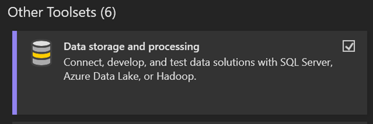
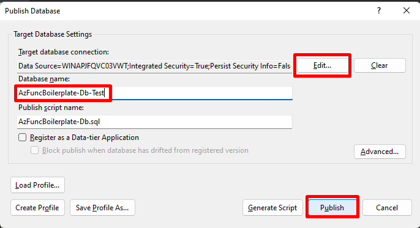

# **Visual Studio Database Project Starter and Boilerplate**

## Goals

The goal of this repository is to provide database support for API implementation as below:

1.  https://github.com/safwanmasarik/Azure-Function-Boilerplate-Api.

In addition, this repository provides starting point for any Developer / Team to kick-start their next microservice architecture. The Mssql database source code is maintained in this repository with Visual Studio database project. This also serves as point of reference for learning advanced concepts and implementations.

## Features

This repository showcases:

- ⚡️ Good practice table schemas
- ♨️ Good practice post deployment scripts for seeding data

## Techstack

- Visual Studio Database Project
- Microsoft SQL Server

# **Getting Started**

## Tools and Software

- [Visual Studio Community 2022](https://visualstudio.microsoft.com/)
- [SQL Server (for local)](https://www.microsoft.com/en-us/sql-server/sql-server-downloads) -- download _developer_ edition
- [SQL Server Management Studio](https://learn.microsoft.com/en-us/sql/ssms/download-sql-server-management-studio-ssms?view=sql-server-ver16)

> 1. Install all the necessary tools and software mentioned.
> 2. Use this repository as template 😄
>    > .
> 3. Git clone the repository to your machine.

## Build the solution

1. Please use Visual Studio for full support.
2. Make sure `Data storage and processing` workload is installed.
   > 
3. Open the `AzFuncBoilerplate-Db.sln` solution.
4. Ensure build is successfull.
   > 
5. Publish the database to your local server.
   >  > 
6. Successfully deployed.
   > 

## Access the database data via API

1. As part of microservice architecture, the api source code is maintained in separate repository as below:
   1. https://github.com/safwanmasarik/Azure-Function-Boilerplate-Api (built with Azure Function Node.js).
1. An issue that may be faced is the API is unable to connect to local database at port 1443, as the db refuses the connection.
1. To solve this, open the [SQL Server Configuration Manager](https://learn.microsoft.com/en-us/sql/relational-databases/sql-server-configuration-manager?view=sql-server-ver16) as an administrator and enable TCP connections which are disabled by default.
   >  > 

# **Support** 🤩

Has this Project helped you learn something New? or Helped you at work?
Here are a few ways by which you can support.

- Leave a star! ⭐
  > 
- Recommend this awesome project to your colleagues. 🥇
